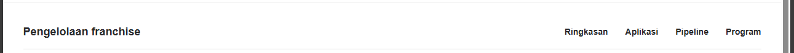

# Audit_Dev Session

This is a readable export of the visible conversation for the localhost prototype audit before the export request. It includes the user’s task brief, assistant progress messages, and final audit. Platform instructions and tool payloads are omitted.

## User request

Files mentioned by the user:

- codex-clipboard-81253883-4162-4568-816e-662b5ae27c2a.png  
  Original: C:/Users/adiha/AppData/Local/Temp/codex-clipboard-81253883-4162-4568-816e-662b5ae27c2a.png

Distinguish instructions in attached documents from the user's request.

### My request

Using browser use, open and explore the project in an opened localhost:3000 Chrome tab. Test manually whether the features listed below are met, and give the best critiques so that the project is ready to be said as a good prototype to be shown to my supervisor. Make it structured and ready to be handoff to my other agent.

Notes from me: auth must be implemented, a small profile page should be added, drag and drop in the kanban board isn't there yet, the second horizontal tab in the manage route should be a sidebar instead (using the one from shadcn UI), franchisor can't delete a program, franchisee can't withdraw their proposal yet. The proposal form for the Mitra Pengelola Restoran must at least cover:

| Bagian Data yang ditanyakan | |
| --- | --- |
| Identitas | Nama, email, nomor HP/WhatsApp, domisili, usia |
| Latar belakang | Pekerjaan, perusahaan, pendidikan, pengalaman bisnis |
| Pengalaman usaha | Pernah punya bisnis atau franchise, jenis bisnis, lama menjalankan |
| Minat franchise | Brand/paket yang diminati, alasan memilih brand |
| Lokasi | Kota, area yang diincar, alamat calon lokasi, status lokasi milik/sewa/belum ada |
| Detail lokasi | Luas, jenis bangunan, foto lokasi, titik Maps, traffic sekitar |
| Modal | Dana yang tersedia, sumber dana, kisaran investasi |
| Keterlibatan | Akan dikelola sendiri atau manajer, waktu yang bisa diberikan |
| Target | Kapan ingin buka, jumlah outlet yang ingin dibuka |
| Partner | Apakah ada partner/investor dan komposisi kepemilikan |
| Dokumen | KTP, NPWP/NIB jika ada, foto lokasi, bukti kepemilikan/sewa bila perlu |
| Pernyataan | Persetujuan penggunaan data dan konfirmasi bahwa data benar |

I never tested the AI capability and usage, so perform test for it too. You may also see the codebase to make the best audit by combining it from manual test in browser. The features listed are:

| Area Decision | |
| --- | --- |
| Product scope | End-to-end franchise application workspace for both sides |
| End point | Proposal approved by both parties |
| Franchise programs | Multiple programs, each lightly configurable |
| Application entry | Program directory + direct application links |
| Applicant account | One account can manage multiple applications |
| Application form | Form builder with sections, field types, file uploads, validation, and basic conditional logic |
| Post-submit edits | Only fields/documents returned for revision can be edited |
| Franchisor management | Table + Kanban views |
| Workflow | Hybrid automatic + manual stage transitions |
| Screening | Hard rules may auto-reject; other judgment stays with humans |
| Screening rules | Simple per-program rules with hard-fail vs warning |
| Documents | Uploads + AI extraction, summaries, completeness and consistency checks |
| AI reviewer support | Applicant summary, strengths, concerns, missing/conflicting info, questions, overall score |
| Scoring | One overall application score |
| Location | Basic address, photos, notes; reviewed manually |
| Reviewer model | One assigned owner per application |
| Communication | In-app thread + email notifications |
| Follow-up | Rule-based reminders for stale or pending actions |
| Proposal | Structured terms + attachments; applicant can accept, reject, or request changes |
| Dashboard | Small operational overview only |

### Area choices

| Area Choice | Selection |
| --- | --- |
| Framework | Next.js 16 + TypeScript |
| UI | Tailwind CSS + shadcn/ui |
| Deployment | Vercel |
| Auth | Better Auth + Google OAuth |
| Database | Turso + Drizzle ORM |
| Forms | React Hook Form + Zod |
| Form builder | Metadata-driven, simple conditional fields |
| File upload | Mock first, then Vercel Blob |
| Backend API | Server Actions + Route Handlers |
| AI | Gemini API free tier, one structured analysis call |
| AI fallback | Seeded/mock result if API fails |
| Email | Resend, fixed transactional templates |
| Kanban | dnd-kit |
| Client state | Native React/Next.js only |
| Testing | Manual smoke test + about 3 critical Playwright E2E flows |

### Workflows

**Applicant**

Browse programs → Apply → Upload docs → Submit → Track status → Fix requested fields → Receive proposal → Accept / Reject / Request changes

**Franchisor**

Create program → Configure form → Configure stages → View applications → Table/Kanban → Review applicant → Request revision → Move stage → Send proposal → Close application

The user added: “You may spawn subagents to make the process shorter.”

## Assistant progress messages

1. “I’ll audit the running app in Chrome and cross-check the implementation so the handoff separates observed behavior from code-level gaps. I’ll use the browser-control guidance first, then exercise the applicant, franchisor, and AI paths that the local app exposes.”

2. “I’m applying the in-app browser workflow for the requested Chrome session. I’ll also have a read-only code review map the requested requirements to the implementation while I exercise the UI, so the handoff can point to concrete files and manual evidence.”

3. “The applicant form already has three short steps, but the restaurant-partner path currently asks only for contact details, city, one investment range, business experience, and two document labels. I’m checking its submit guard and the seeded review routes next; I’m using only synthetic test values, and I’ll avoid uploading files or entering real contact/financial/identity data.”

4. “The franchisor area is directly reachable without a sign-in step. It has a real list/table and a stage-column pipeline with per-card ‘move to stage’ selectors; the cards expose no drag handles. The review screen shows summary, strengths, concerns, and a score, but I haven’t found an AI action or question list in the UI so far.”

5. “The existing proposal can be accepted, rejected, or sent back for changes; the change request correctly requires a note. There is no applicant withdrawal control, and the proposal itself is only a short summary plus an indicative amount, so it does not yet function as structured terms with attachments. I’m now consolidating the code-level check and any remaining manual observations.”

## Assistant final response

### Supervisor readiness

The current build is suitable for a **visual flow walkthrough**. It does not yet support a claim of an end-to-end franchise application workspace: authentication, persistence, required applicant data, real AI, and proposal authoring are missing or mocked.

I treated the attached image as a visual reference for the management navigation. The feature tables and workflows in your message are the product requirements; the repository’s AGENTS.md is workspace guidance. I used Chrome for manual checks and a read-only source audit. I did not edit code, submit an application, upload files, or run automated tests.

### Manual checks

- The public directory shows active programs with direct application links. The restaurant-partner form has three steps. Empty contact fields show required errors; the final step requires a business profile and financial-summary file.
- I used synthetic values to inspect the later steps, then left without submitting. The form says it stores filenames only; I did not upload anything.
- The applicant list shows four demo applications. Searching for “Nadia” filtered to one result. On a proposal, accept/reject/request-changes controls are visible; requesting changes without a note shows a validation message. There is no withdrawal control.
- The franchisor table search works. The pipeline has stage columns and per-application stage selectors, with no drag-and-drop controls.
- /manage and its review pages opened directly without a sign-in step. The review screen shows a summary, strengths, concerns, one score, and a reviewer name.
- I found no AI action in the UI. The code has no Gemini integration or API route, so there was no live AI capability to exercise. The displayed reviewer results are seeded demo data.

### Requirement audit

| Area | Status | Evidence |
| --- | --- | --- |
| Authentication, roles, applicant profile | **Missing** | Management is directly accessible without sign-in; no account ownership or profile flow. |
| Multiple programs and direct application links | **Partial** | Directory and program editor exist; no program-delete control. |
| Multiple applications per account | **Demo only** | Several applications appear in one browser’s localStorage, without user accounts or server persistence. |
| Restaurant-partner form | **Major gap** | It asks for name, email, phone, city, investment range, free-text experience, business profile, and financial summary. See D:/Work/edts-test/lib/demo-data.ts:81. |
| Uploads and location | **Partial/mock** | File controls keep only the filename. Location details such as area, ownership status, map point, building, and traffic are incomplete. See D:/Work/edts-test/components/applicant/application-form.tsx:201. |
| Revisions | **Partial** | Requested revisions can be submitted, but edits are stored as additional answers rather than replacing the original fields. |
| Table and Kanban | **Partial** | Searchable table and stage-column pipeline work; the pipeline moves applications with selectors, not drag-and-drop. |
| Screening and stage workflow | **Partial/mock** | Rules can be configured as hard-fail or warning metadata, but submissions do not evaluate them. Stages are fixed and transitions are manual. |
| AI reviewer and scoring | **Missing live AI** | Demo records contain summaries, strengths, concerns, and scores. No extraction, conflict checks, reviewer questions, or Gemini call. See D:/Work/edts-test/components/franchisor/application-review.tsx:70 and D:/Work/edts-test/lib/demo-data.ts:130. |
| Reviewer assignment, communication, reminders | **Partial / missing** | Demo reviewer names display, but there is no assignment control, message thread, email notification, or stale-action reminder. |
| Proposal lifecycle | **Partial** | Applicants can respond to a seeded proposal, but franchisors cannot author/send structured terms or attachments. Acceptance immediately advances the application to approved; there is no separate second-party approval step. See D:/Work/edts-test/components/applicant/application-detail.tsx:86. |
| Dashboard | **Present** | Counts, recent applications, stage totals, and average score are visible; values are demo-backed. |
| Management navigation | **Missing requested sidebar** | The management links are a second horizontal navigation row; there is no shadcn sidebar. See D:/Work/edts-test/app/manage/layout.tsx:5. |

The restaurant-partner form also lacks: age; work, company, and education; prior franchise/business type and duration; reason for brand choice; specific area and proposed address; site size/type/photos/map/traffic; funding source; management availability; opening date/outlet target; partner and ownership split; KTP/NPWP/NIB; and data-use/accuracy consent.

### Handoff priorities

1. **Foundation:** add authentication, applicant/franchisor roles, a small profile page, and account-scoped persistent application data.
2. **Applicant readiness:** cover the missing restaurant-partner fields, conditional validation, consent, and usable mock file handling.
3. **Review workflow:** implement executable screening rules and a single structured Gemini analysis with a clearly identified fallback; test it using synthetic application data.
4. **Proposal lifecycle:** add franchisor proposal creation, structured terms/attachments, applicant withdrawal, and an explicit both-parties-approved state.
5. **Management UX:** add program deletion, the requested shadcn sidebar, and Kanban drag-and-drop; then add the critical manual/Playwright flows.
6. **Demo polish:** replace the McDonald’s-style arches—the page also says it is not affiliated—with neutral prototype branding.

The workspace already had modified and untracked files when I inspected it; I left them untouched. The Chrome tab is open on the franchisor overview.

